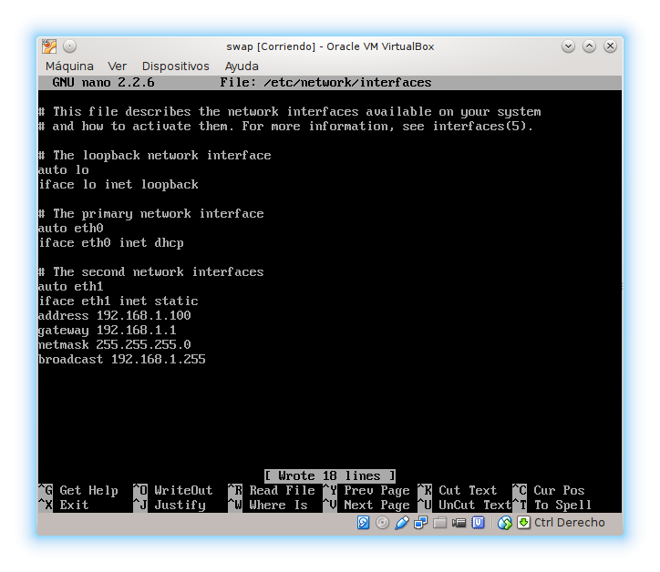
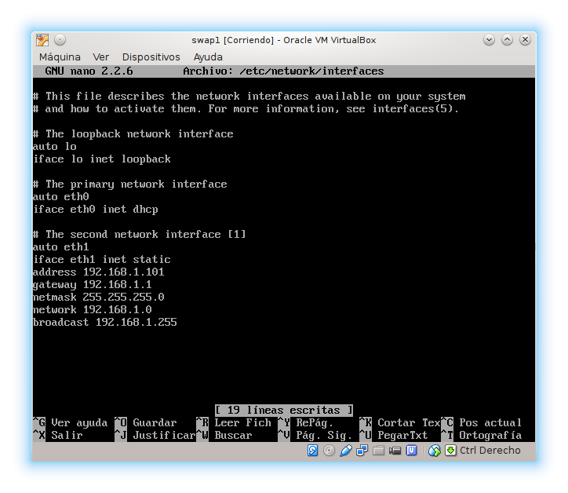
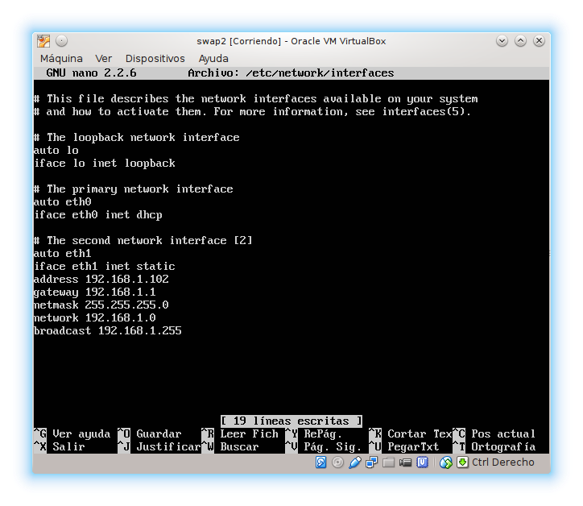
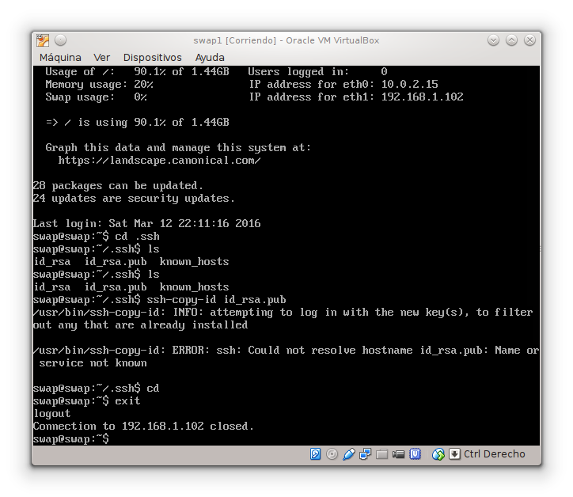
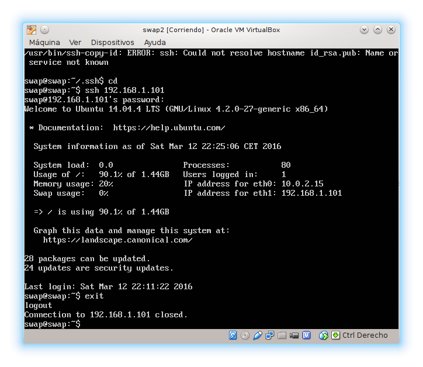

### Práctica 1 ###

Hemos hecho los siguientes pasos:

 1. Ejecutamos el comando rsync para la transmisión y sincornización eficiente de datos

      * rsync -avz -e ssh IP1:/var/www/html /var/www/html

 2. Creamos una clave

      * ssh-keygen -t rsa

 3. Copiamos la clave

      * ssh-copy-id .ssh/id_rsa.pub

 4. Programar sincronizacion

      * scrontab /etc/crontab ***** root update.sh

 5. Configurar red interna en Virtualbox

 6. Probamos la conexión

