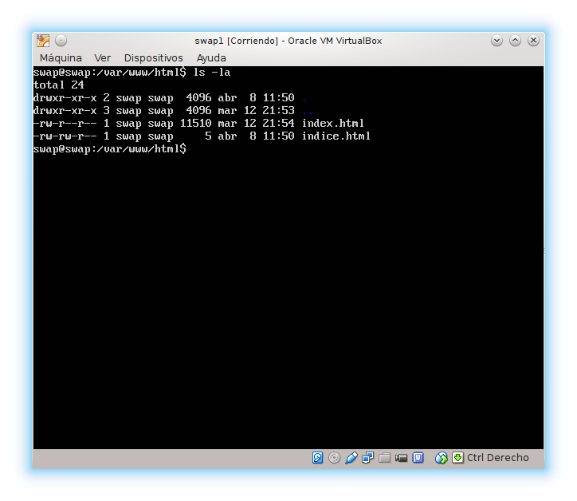
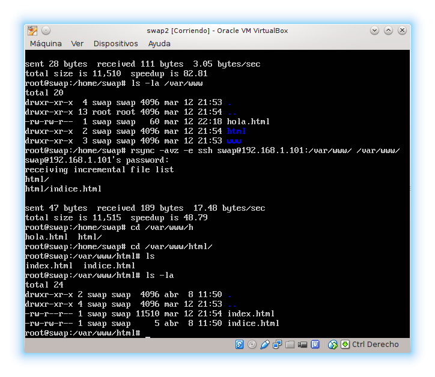
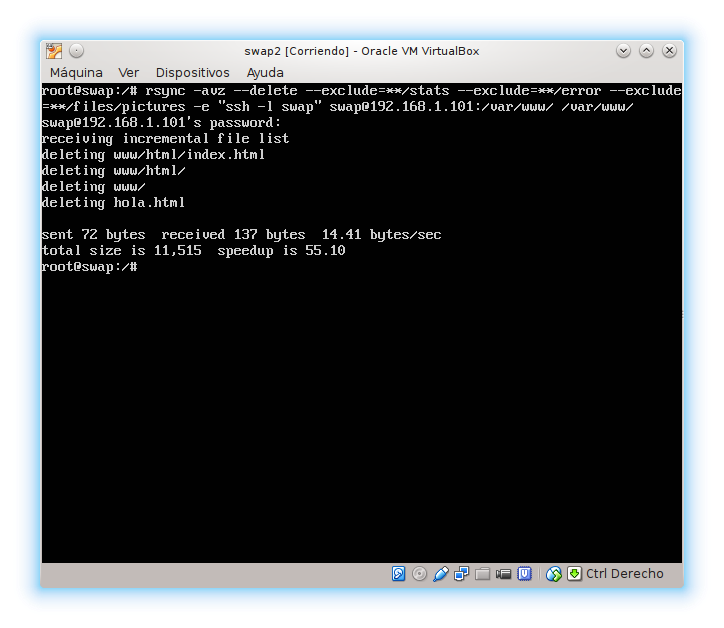
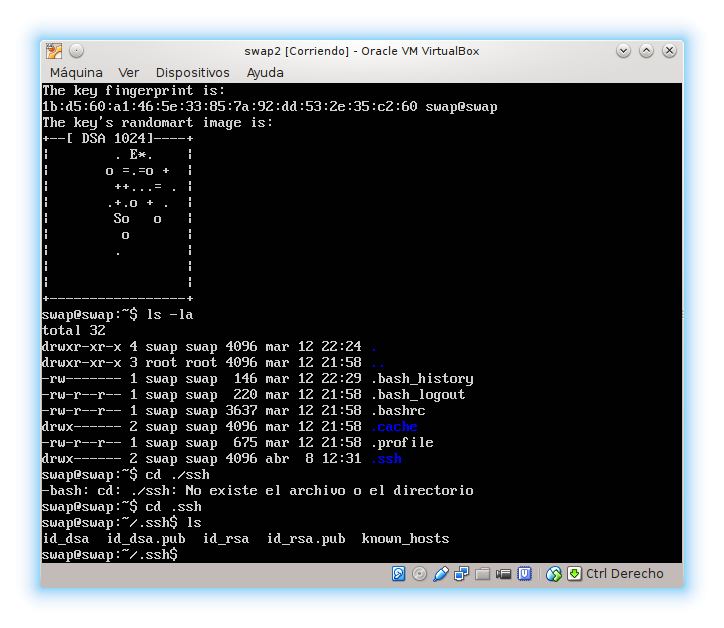
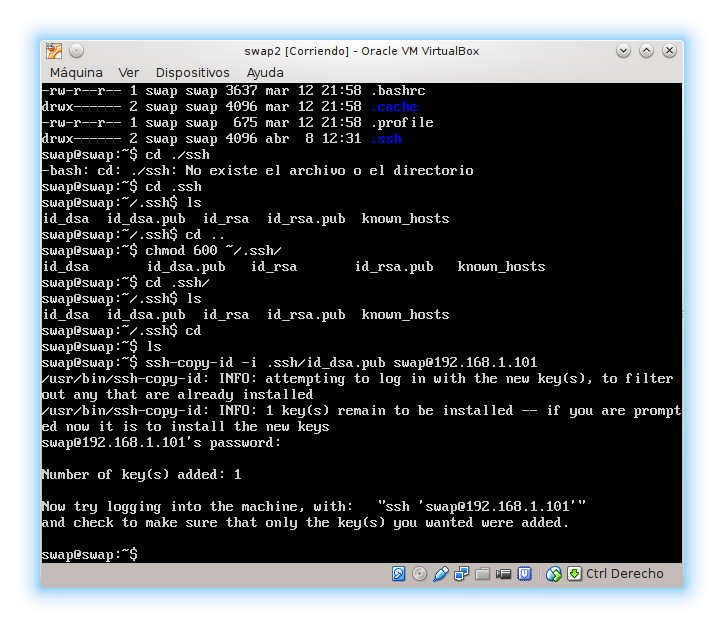
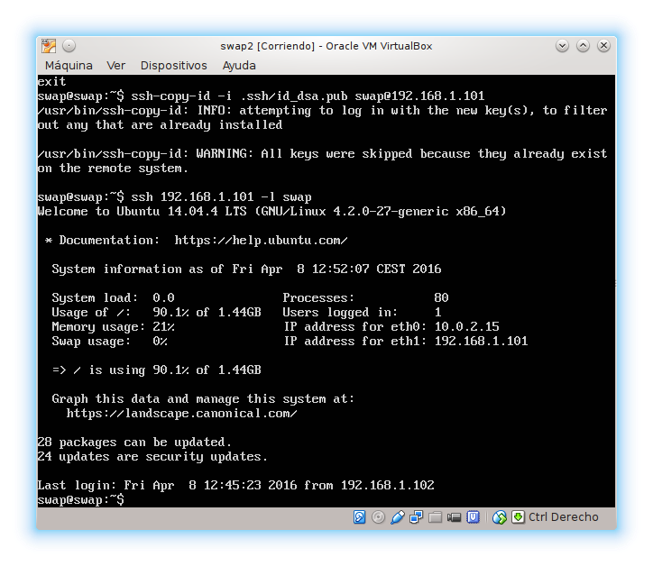
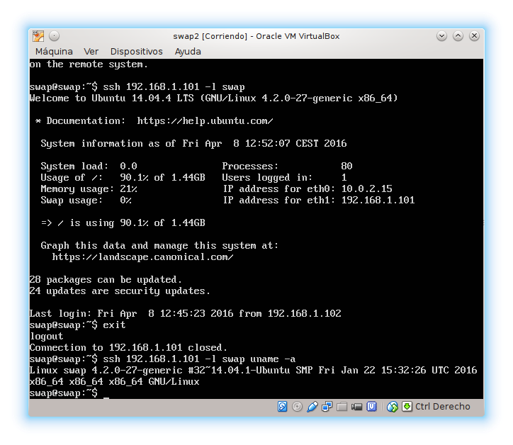
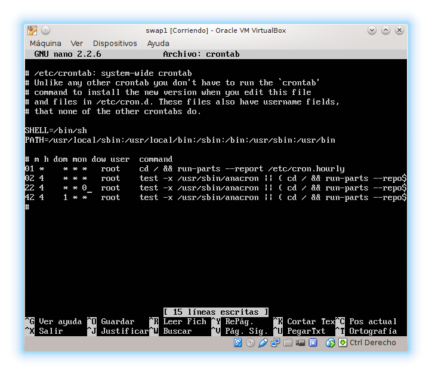

### Práctica 2 ###

Hemos hecho los siguientes pasos:

 1. Ejecutamos el comando rsync para la transmisión y sincornización eficiente de datos

      * rsync -avz -e ssh swap@192.168.1.101:/var/www/ /var/www/

      

      

 2. Hacemos la copia completa del directorio /var/www pero excluyendo /var/www/error , /var/www/stats y /var/www/files/pictures

      * rsync -avz --delete --exclude=**/stats --exclude=**/error --exclude=**/files/pictures -e "ssh -l swap" swap@192.168.1.101:/var/www/ /var/www/

      

 3. Acceso sin contraseña para ssh

      * ssh-keygen -t dsa

      

4. Usamos  el comando "ssh-copy-id" para hacer una copia de la clave a la máquina principal (a la que querremos acceder luego desde la secundaria):

     * ssh-copy-id -i .ssh/id_dsa.pub  swap@192.168.1.101
     

     Conectarnos a dicho equipo sin contraseña:

     * ssh 192.168.1.101 -l swap
     

     Para ejecutar comandos añadimos al final del comando ssh para conectarnos:

     * ssh 192.168.1.101 -l swap uname -a
     

 5. Programar tareas con crontab

      * /etc/contrab
      

***
