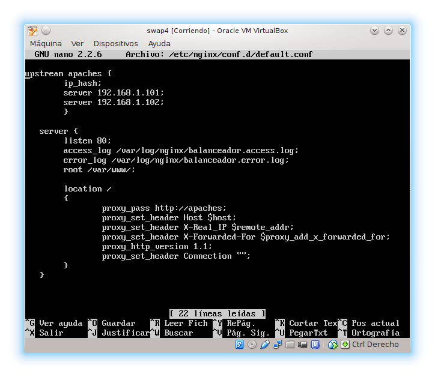
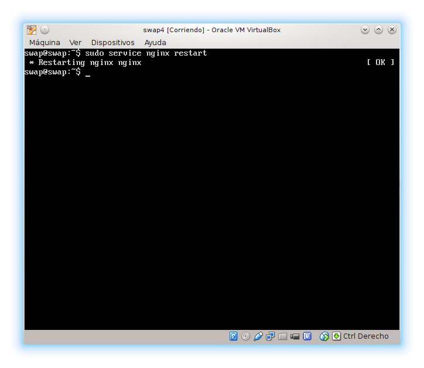
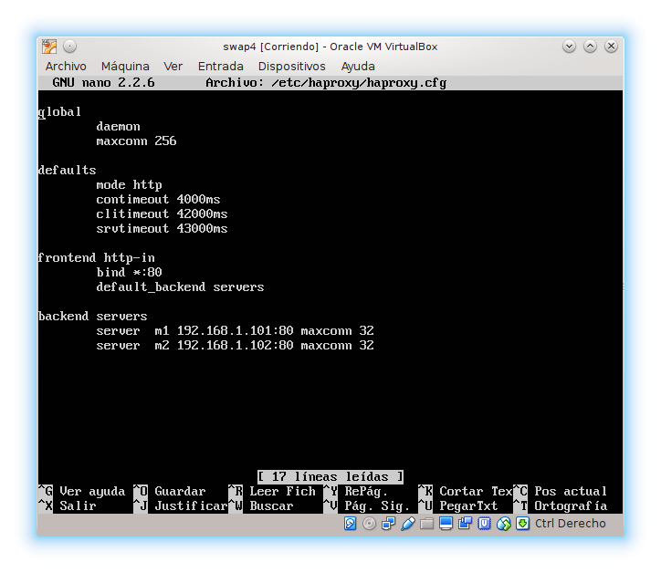

### Práctica 3 - Balanceo de carga ###

Hemos hecho los siguientes pasos:

 1. Instalación del nginx
      ~~~
      cd /tmp/
      wget http://nginx.org/keys/nginx_signing.key
      sudo apt-key add /tmp/nginx_signing.key
      rm -f /tmp/nginx_signing.key
      ~~~

      Añadimos el repositorio al fichero: /etc/apt/source.list
      ~~~
      echo "deb http://nginx.org/packages/ubuntu/ lucid nginx" >> /etc/apt/sources.list
      echo "deb-src http://nginx.org/packages/ubuntu/ lucid nginx" >> /etc/apt/sources.list
      ~~~

      Instalamos el paquete nginx:
      ~~~
      apt-get install nginx
      ~~~      

      Hemos modificado el fichero de configuración /etc/nginx/conf.d/default.conf.

      Definimos nuestro cluster web con las IPs de los servidores finales con la seleccion "upstream":

      ~~~
      upstream apaches {
        ip_hash;  
        server 192.168.1.101;
        server 192.168.1.102;
      }     
      ~~~
      La seccion "server" nos indica que estamos haciendo uso del grupo definido anteriormente en upstream, definimos asi las maquinas a las que debe repartir el trafico.

      ~~~
      server{
      listen 80;
      server_name balanceador;

      access_log /var/log/nginx/balanceador.access.log;
      error_log /var/log/nginx/balanceador.error.log;
      root /var/www/;

      location /
      {
        proxy_pass http://apaches;
        proxy_set_header Host $host;
        proxy_set_header X-Real-IP $remote_addr;
        proxy_set_header X-Forwarded-For $proxy_add_x_forwarded_for;
        proxy_http_version 1.1;
        proxy_set_header Connection "";
      }
    }
    ~~~
    Usaremos el metodo de balanceo round-robin, de igual prioridad para todos los servidores.

    Reiniciamos el servivio:
    ~~~
    sudo service nginx restart
    ~~~

      

      

 2. Instalación del haproxy
      ~~~
      apt-get install haproxy      
      ~~~

      Para configurar el haproxy editamso el fichero /etc/haproxy/haproxy.cfg

      Configuramos para que pueda escuchar el trafico en el puerto 80 y redirigirlo a alguna de las maquinas servidoras finales (debe conocer sus IP). Por lo que usaremos como configuracion inicial la siguiente:

      

      Lanzamos el sercicio:

      ~~~
      /usr/sbin/haproxy -f /etc/haproxy/haproxy.cfg
      ~~~

***
