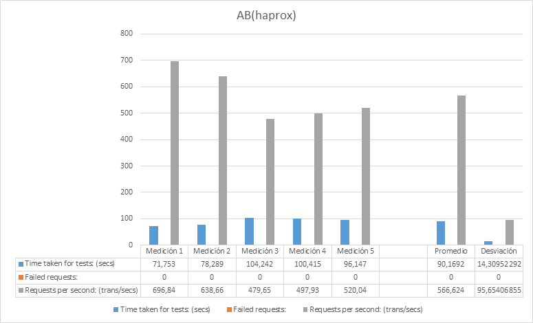
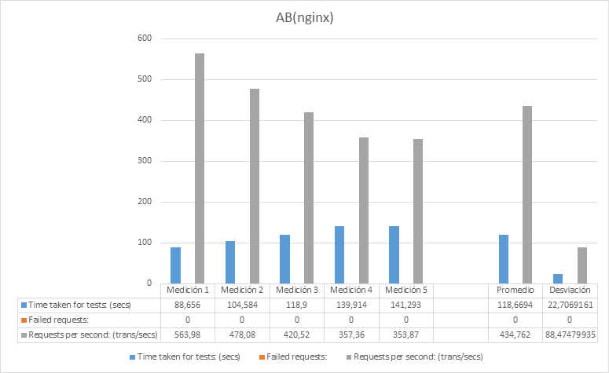
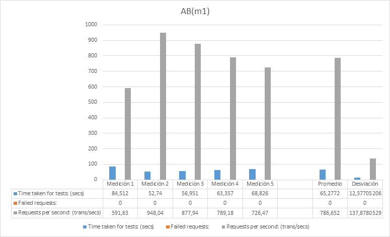
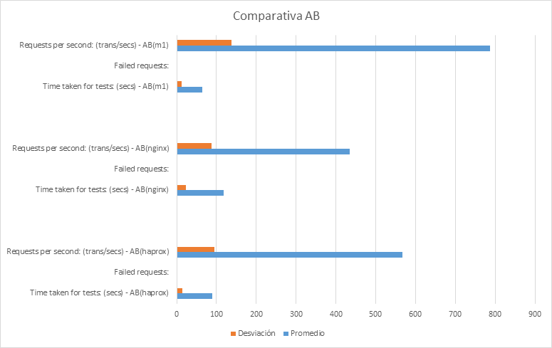
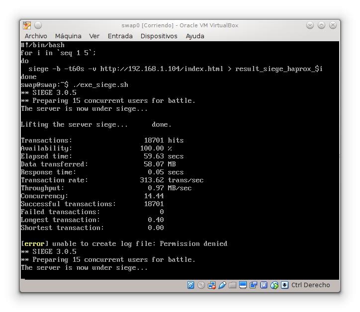
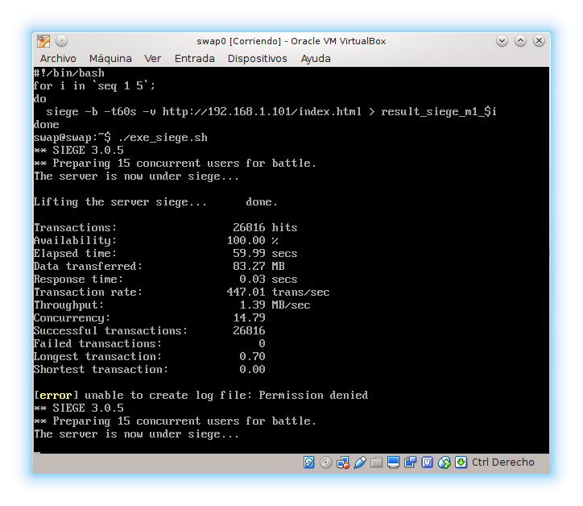
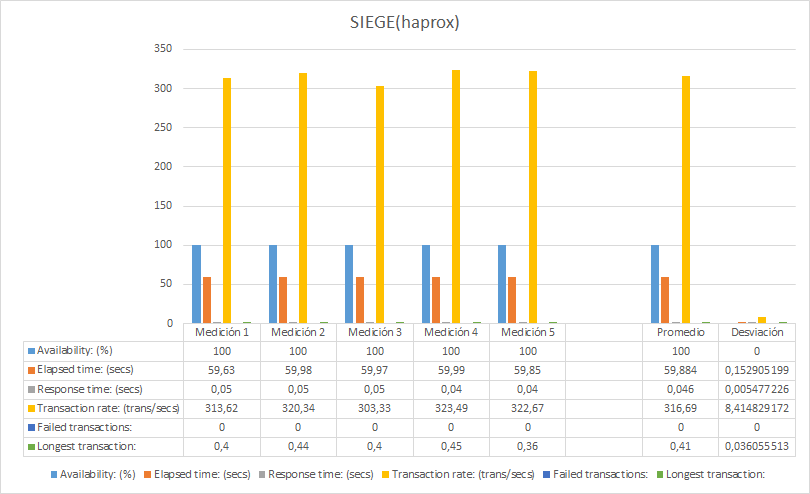
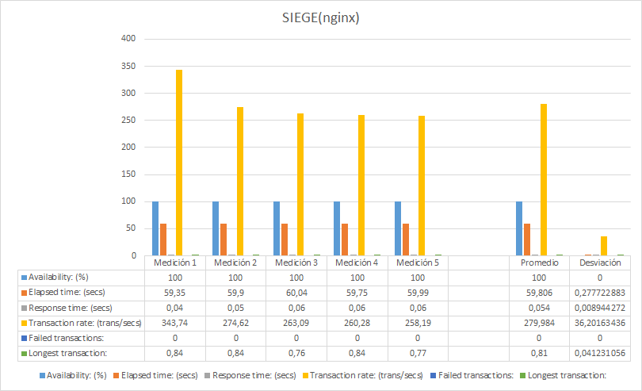
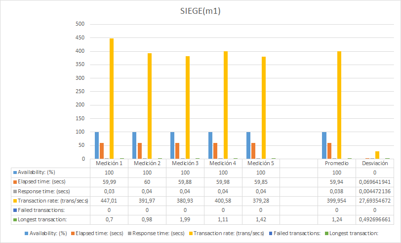
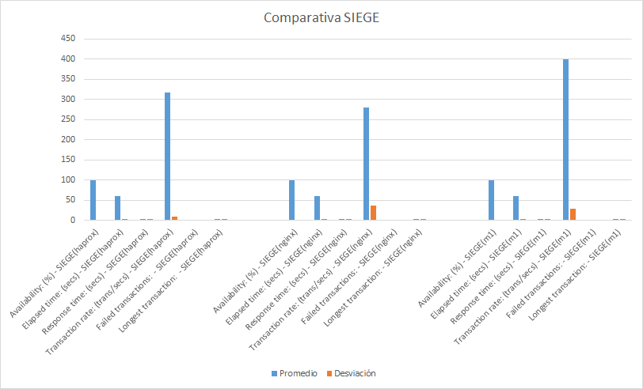

### Práctica 4 - Comprobar el rendimiento de servidores web ###

1. ApacheBench

      ApacheBench (ab) es un programa de ordenador línea de comandos de un solo subproceso para medir el rendimiento de los servidores web HTTP. [1] Originalmente diseñado para probar el servidor HTTP Apache, que es lo suficientemente genérico como para probar cualquier servidor web.

      Hemos ejecutado un script para la serie de pruebas con la sieguiente instrucción:

        > ab -n <nº de peticiones> -c <nº concurrencia> <direccion destinataria>

     * nº de peticiones: es el nº total de peticiones que se enviara al servicor destinatario

     * nº de concurrencia: cantidad de peticiones que se enviaran al ervidor destinatario, en cada solicitud

     * direccion destinataria: direccion o identificador del servidor al que enviaremos las peticiones

      
      
      

      Hemos obtenido los siguientes resultados:

      
      
      

      La comparativa final de la prueba en ApacheBench:

      

      Podemos ver en la comparativa final que tarda más el servidor que tiene el balanceador de carga, esto se debe, a que el "camino" se se recorre a traves del balanceador de carga es mas largo. Tambien podemos ver como nginx tarda menos que haproxy.

      Además podemos ver como el servidor final responde mas peticiones por segundo que el balanceador de carga. Algo normal, debido a que este es mas rapido como hemos visto en la grafica anterior.

2. Siege

      El Siege fue diseñado para permitir a los desarrolladores web mediren el rendimiento de su código bajo estrés, para ver cómo se comporta el código frente a la carga en Internet.

      > siege <opciones de ejecucion> <direccion destinataria>

    Las opciones de ejecucion que utilizaremos seran -b -t60S -v
      * b ejecutaremos los tests sin pausas con lo que comprobaremos el rendimiento general
      * t60s ejecutaremos siege durante 60 segundos
      * v le indicamos que nos muestre mas informacion
    Direccion o identificador del servidor al que enviaremos las peticiones

    
    
    

    Hemos obtenido los siguientes resultados:

    
    
    

    La comparativa final de la prueba en ApacheBench:

    
***
