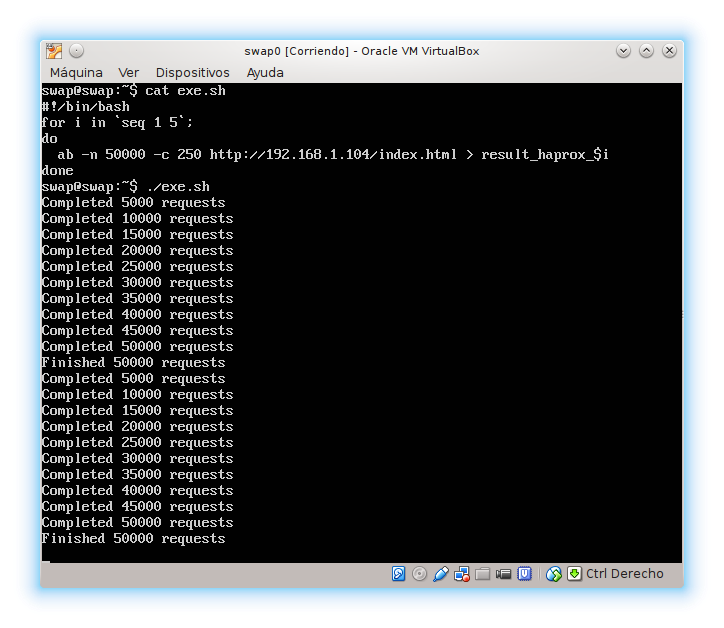
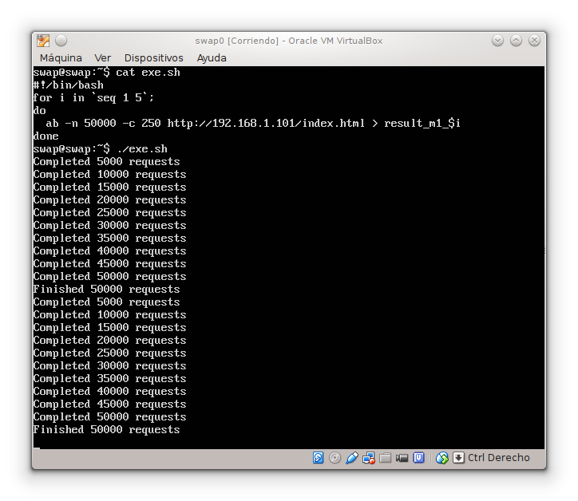

### Práctica 4 - Comprobar el rendimiento de servidores web ###

 1. ApacheBench

      ApacheBench (ab) es un programa de ordenador línea de comandos de un solo subproceso para medir el rendimiento de los servidores web HTTP. [1] Originalmente diseñado para probar el servidor HTTP Apache, que es lo suficientemente genérico como para probar cualquier servidor web.

      Hemos ejecutado un script para la serie de pruebas con la sieguiente instrucción:

      ~~~
        ab -n <nº de peticiones> -c <nº concurrencia> <direccion destinataria>
      ~~~

      
      
      

 2. Siege

***
