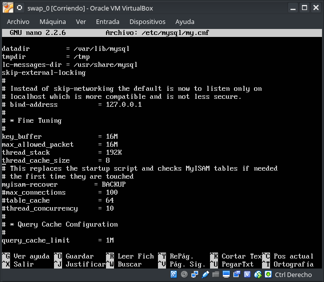

### Práctica 5. Replicación de bases de datos MySQL ###

1. Crear una BD e insertar datos

  Hemos creado una base de datos en MySQL e insertaremos algunos datos.

  

2. Replicar una BD MySQL con mysqldump

  Antes de hacer la copia de seguridad en el archivo .sql debemos evitar que se acceda a la BD para eso bloqueamos la BD.
  ~~~
  mysql> flush tables with read lock;
  ~~~
  

  Creamos una copia local de nuestra base de datos, tenemos que acceder como root:
  ~~~
  #root> mysqldump contactos -u root -p > /root/contactos.sql
  ~~~
  Comprobamos com * ls -la /root/ * si se ha creado la copia.

  

  Una vez ya hemos creado nuestra copia, procedemos a desbloquear las tablas:
  ~~~
  mysql> unlock tables;
  ~~~
  

  Enviamos la BD a la otra máquina y la ubicamos en /root/.

  

  Restauración, en equipo remoto, de la base de datos con la información del equipo maestro y comprobamos la base de datos y consultaremos su contenido, podemos ver que el proceso se ha realizado con éxito.

  
  

3. Replicación de BD mediante una configuración maestro-esclavo

  Lo primero que haremos, sera configurar el MySQL del equipo maestro. Para ello editaremos como root el fichero /etc/mysql/my.cnf:

    * Comentamos el parámetro bind-address. Este sirve para que escuche a un servidor.
    * Le indicamos el archivo donde almacenar el log de errores. De esta forma, si por ejemplo al reiniciar el servicio cometemos algún error en el archivo de configuración, en el archivo de log nos mostrará con detalle lo sucedido.
    * Establecemos el identificador del servidores.
    * Le indicamos el archivo de registro binario. El registro binario contiene toda la información que está disponible en el registro de actualizaciones, en un formato más eficiente y de una manera que es segura para las transacciones.

    Guardamos las configuraciones y reiniciamos el servicio, con unos de los comandos a seguir:
    ~~~
    sudo service mysql restart
    /etc/init.d/mysql restart
    ~~~
    
    
4.
***
