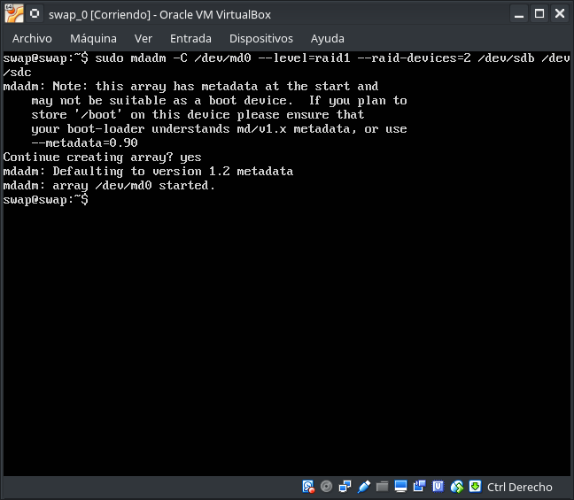
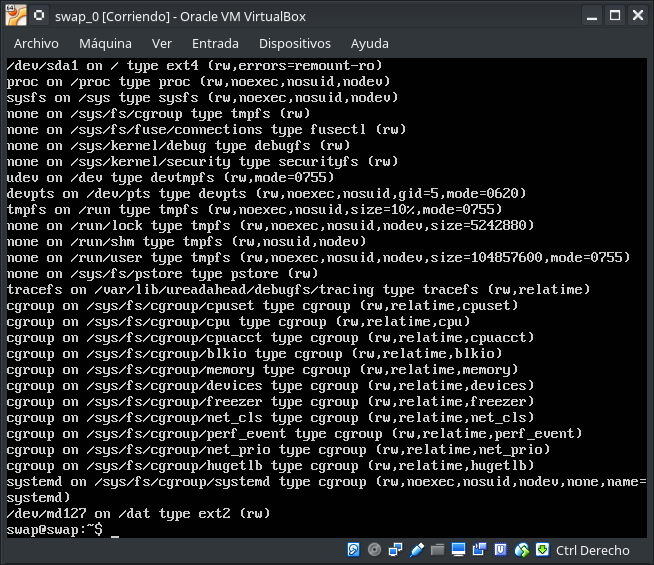
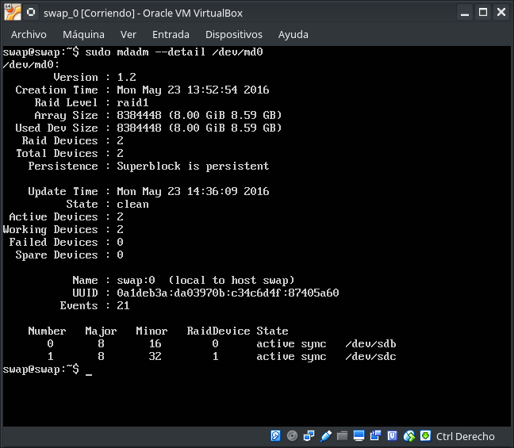
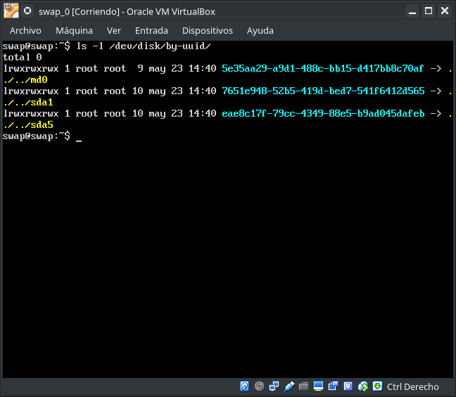
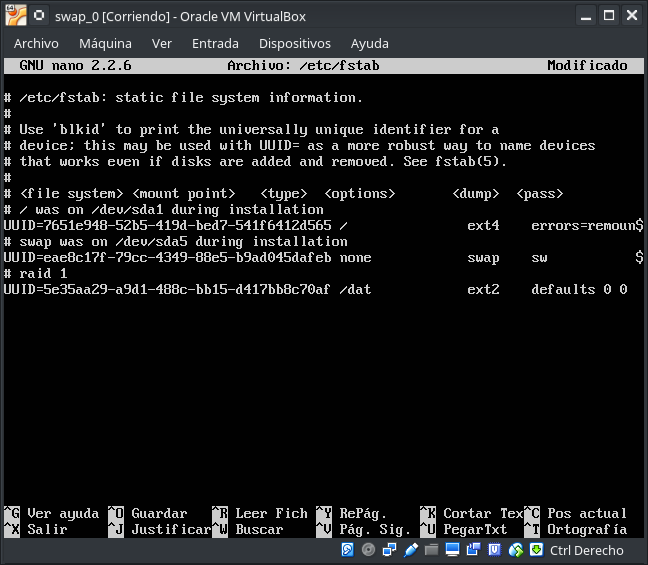

### Práctica 6. Discos en RAID ###

1. Configuración del RAID por software

  Primeramente tenemos que configurar un controlador Small Computer System Interface, más conocida por el acrónimo inglés SCSI (interfaz de sistema para pequeñas computadoras), es una interfaz estándar para la transferencia de datos entre distintos dispositivos del bus de la computadora, a través de este controlador SCSI añadiremos 2 discos con la misma capacidad de nuestra máquina principal.

    

  Ahora arrancamos la maquina principal y instalamos el software necesario para configurar el RAID

  Usaremos Multiple Device Administrator, MDADM es un conjunto de herramientas que son utilizadas en GNU/Linux para la gestión de RAID (Redundant Array of Independent Disks, que se traduce como conjunto redundante de discos independientes) administrado a través de software, distribuido bajo los términos de la Licencia Pública General de GNU versión 2 (GNU/GPLv2).

  El RAID por software permite:

    * Una solución de RAID de muy bajo costo pues prescinde del uso de costosas tarjetas RAID y unidades de almacenamiento especiales y que carece de restricciones que regularmente imponen los fabricantes de dispositivos de hardware privativos.

    * Proceso de reconstrucción de arreglos en subprocesos.

    * Configuración basada sobre el núcleo del sistema.

    * Permite portar de manera transparente los arreglos entre sistemas GNU/Linux sin necesidad de reconstruir éstos.

    * Mejor aprovechamiento de los recursos del sistema pues la reconstrucción de los arreglos se hace utilizando recursos libres.

    * Soporte para unidades de almacenamiento con capacidad para realizar cambios en caliente (hot-swap).

    * Detección automática del número de núcleos del microprocesador a fin de aprovechar mejor los recursos del sistema.

    Después de instalar el MDADM ejecutamos *sudo fdisk -l*

  **Durante el proceso de insalacion nos preguntará si queremos intalar Postfix, elegimos la opcion Sin configuración**

  

  Ahora tenemos 3 discos, en los cuales el primero es en el que esta instalado el sistema, por eso nos muestra su tabla de particiones los otros 2 son los que hemos creado a través del controlador SCSI y no tienen tabla de particiones, todavia entán vacios.

  Ahora ya podemos crear el RAID 1. Para ello "crearemos" un dispositivo nuevo, /dev/md0, que "contendra" los dos discos que hemos creado, /dev/sdb y /deb/sdc

  

  **El dispositivo se creó con el nombre /dev/md0**

  Después de crear el dispositivo RAID inicializamos un dispositivo de almacenamiento con *mkfs* y creamos el directorio en el que se montará la unidad del RAID con *mkdir* y lo montamos con *mount*:

  ~~~
  #root> mkfs /dev/md0
  #root> mkdir /dat
  #root> mount /dev/md0 /dat
  ~~~

  Comprobamos si se ha montado correctamente con *mount* y el estado del RAID con *mdadm --detail /dev/md0*:

  ~~~
  #root> mount
  #root> mdadm --detail /dev/md0
  ~~~
  
  

  Procedemos a editar el fichero */etc/fstab* y agregar el montaje automático del dispositivo que hemos creado y para esto necesitamos su UUID, con el comando *ls -l /dev/disk/by-uuid/*

  
  

  
  
  

***
