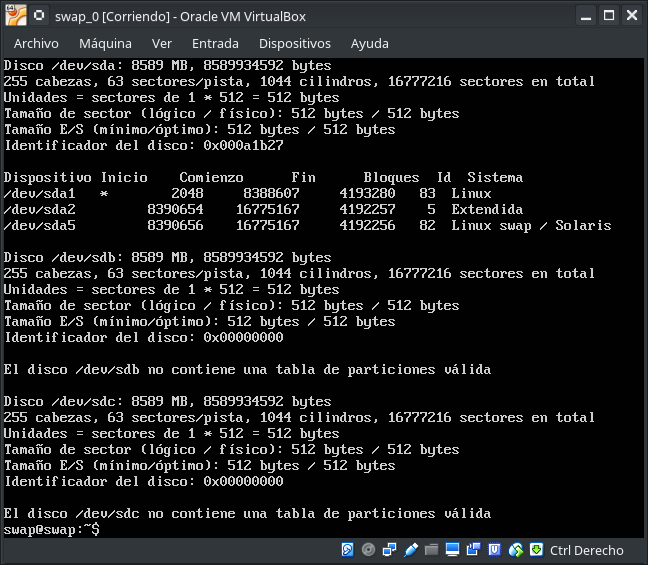

### Práctica 6. Discos en RAID ###

1. Configuración del RAID por software

  Primeramente tenemos que configurar un controlador Small Computer System Interface, más conocida por el acrónimo inglés SCSI (interfaz de sistema para pequeñas computadoras), es una interfaz estándar para la transferencia de datos entre distintos dispositivos del bus de la computadora, a través de este controlador SCSI añadiremos 2 discos con la misma capacidad de nuestra máquina principal.

    

  Ahora arrancamos la maquina principal y instalamos el software necesario para configurar el RAID

  ~~~
  Durante el proceso de insalacion nos preguntará si queremos intalar Postfix, elegimos la opcion Sin configuración
  ~~~
  

  Ahora tenemos 3 discos, en los cuales el primero es en el que esta instalado el sistema, por eso nos muestra su tabla de particiones los otros 2 son los que hemos creado a través del controlador SCSI y no tienen tabla de particiones, todavia entán vacios.

  Ahora ya podemos crear el RAID 1. Para ello "crearemos" un dispositivo nuevo, /dev/md0, que "contendra" los dos discos que hemos creado, /dev/sdb y /deb/sdc

2. Replicar una BD MySQL con mysqldump

***
